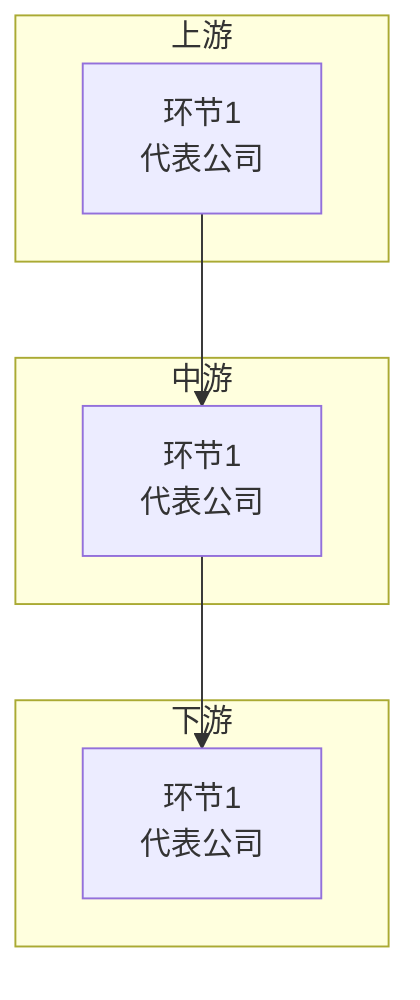

# 行业产业链研究方法（打包自 industry-chain-research）

> 主线挖掘需要精读单个行业时，使用本文件的9章产业链框架。
> 核心原则：每家公司必须有"判断"段落，不只罗列正面信息。

---

## 一、9章产业链研究框架

| 章 | 目的 | 内容要点 |
|----|------|---------|
| 一 | 行业概述与全链条流程 | 行业定义、市场规模、发展历程、全链条流程图 |
| 二 | 产业链全景图 | Mermaid/ECharts 可视化，标注各环节代表公司 |
| 三 | 各环节龙头公司详解 | 按产业链环节分组，每环节3-8家公司卡片 |
| 四 | 行业核心赛道专题 | 最受关注/投资价值的细分赛道 |
| 五 | 关键支撑环节 | 配套/支撑环节（设备/材料/耗材等） |
| 六 | 真伪辨识 | 真业绩/潜力型/概念承压的判断标准 |
| 七 | 商业化与供应链 | 从生产到终端的全过程 |
| 八 | 政策与监管 | 监管环境、政策影响 |
| 九 | 前沿趋势与技术演进 | 技术方向、产业方向、投资机会 |

---

## 二、标准化公司卡片

每家公司使用统一卡片格式：

```html
<div class="company-card">
  <div class="card-header">
    <span class="card-name">公司名称</span>
    <span class="card-code">sh600521</span>
    <span class="card-tag real">真业绩</span>
  </div>
  <div class="card-body">
    <p><strong>做什么的：</strong>一句话说清主营业务。</p>
    <p><strong>产业链位置：</strong>在全景图中处于哪个环节。</p>
    <p><strong>近期业绩：</strong>最新财报关键数据，注明报告期。</p>
    <p><strong>核心看点：</strong>2-4个关键看点。</p>
    <p><strong>判断：</strong>客观评价，含机会与风险。</p>
  </div>
  <div class="card-meta">
    <span>关键指标1</span>
    <span>关键指标2</span>
    <span>关键指标3</span>
  </div>
</div>
```

### 卡片写作规范

1. **做什么的**：一句话说清，不堆砌形容词
2. **产业链位置**：必须与全景图中的环节对应
3. **近期业绩**：必须标注报告期，如"2025年营收166亿(+10%)"
4. **核心看点**：每个看点是完整逻辑链，不是关键词
5. **判断**：必须包含机会和风险两面

---

## 三、三色标签体系

| 标签 | 颜色 | 含义 |
|------|------|------|
| 真业绩 | 绿色 | 连续2+年正利润、经营现金流为正、营收稳定增长 |
| 潜力型 | 蓝色 | 有真实产品/管线但尚未盈利、有明确兑现节点 |
| 概念/承压 | 橙色 | 概念>实质、业绩持续下滑、估值远高于行业均值 |

### 行业定制判断指标

| 行业 | 真业绩关键指标 | 潜力型关注点 | 概念/承压红旗 |
|------|---------------|-------------|-------------|
| 医药 | 药品销售额、医保谈判、临床进度 | 管线深度、靶点创新性 | 研发费用资本化率高 |
| 半导体 | 产能利用率、客户认证、制程能力 | 良率提升、国产替代进度 | 概念多但无量产订单 |
| 新能源 | 装机量、发电小时数、度电成本 | 技术路线领先性 | 补贴依赖度高 |
| 化工 | 产品价差、开工率、一体化程度 | 新材料突破、进口替代 | 环保处罚多 |

---

## 四、产业链全景图

### ECharts力导向图（节点多/关系交叉时优先）

```html
<div id="chainChart" style="width:100%;height:760px;"></div>
<script>
(function() {
  var chart = echarts.init(document.getElementById('chainChart'));
  var categories = [
    {"name":"上游","itemStyle":{"color":"#2563eb"}},
    {"name":"中游","itemStyle":{"color":"#16a34a"}},
    {"name":"下游","itemStyle":{"color":"#ea580c"}}
  ];
  var nodes = [
    {"id":"A1","name":"环节名","category":0,"companies":"代表公司A·公司B","symbolSize":30}
  ];
  var links = [
    {"source":"A1","target":"B1"}
  ];
  chart.setOption({
    tooltip: { formatter: function(p) { ... }},
    series: [{ type: 'graph', layout: 'force', roam: false, draggable: true }]
  });
})();
</script>
```

### Mermaid备选



---

## 五、真伪辨识方法论

### 四层辨识框架

1. **商业模式辨识**：靠什么赚钱？收入是否可验证？行业地位是否真实？
2. **财务质量辨识**：利润是否真实（经营现金流vs净利润）？增长是否可持续？
3. **概念辨识**："故事"是否有数据支撑？研发投入vs产出是否匹配？
4. **估值辨识**：当前估值 vs 历史区间 vs 同行业可比

### 常见红旗信号

1. 概念多于数据
2. 研发费用资本化率过高
3. 客户集中度异常
4. 现金流背离（净利润正但经营现金流持续负）
5. 大量关联交易
6. 频繁融资稀释

---

## 六、数据时效性要求

1. 优先使用最新财报（当年年报 + 次年半年报/季报）
2. 每个财务数据必须标注来源报告期
3. 关键数据至少2个来源验证
4. 数据来源优先级：公司年报 > 行业协会 > 财经媒体 > 公司新闻稿